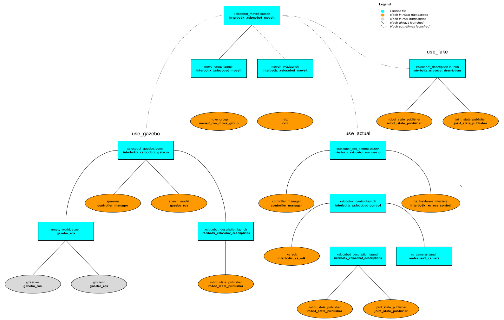

# interbotix_locobot_moveit

## Overview
This package contains the necessary config files to get any rover in the Interbotix X-Series Locobot Family working with MoveIt. Originally, the MoveIt Setup Assistant wizard was used to generate a MoveIt package for each robot individually. The packages were then all merged into one and the launch files modified so that a few arguments could be passed down to load the right config files (specifically the SRDFs). Additionally, this package makes use of the FollowJointTrajectory interface which seems to work pretty well in both Gazebo and on the physical robot. A 'master' launch file was then written to allow a user to choose whether to have MoveIt work with the simulated version, the physical robot hardware, or a MoveIt generated fake robot.

## Structure

As shown above, this package builds on top of both the *interbotix_xslocobot_gazebo* and *interbotix_xslocobot_control* packages. To get familiar with those packages, please refer to their respective READMEs. Regarding the MoveIt specific nodes, they are described below:
- **move_group** - responsible for planning the trajectories needed to achieve a particular arm/gripper pose
- **rviz** - responsible for showing the robot model and including the MoveIt MotionPlanning plugin

## Usage
To run this package on the physical robot, type the line below in a terminal (assuming the **locobot_px100** with no lidar is being launched).
```
$ roslaunch interbotix_xslocobot_moveit xslocobot_moveit.launch robot_model:=locobot_px100 use_actual:=true dof:=4
```
If running this package on a Gazebo simulated robot, type the line below in a terminal (assuming the **locobot_wx200** with lidar is being launched). Don't forget to unpause the Gazebo physics afterwards or MoveIt will never load!
```
$ roslaunch interbotix_xslocobot_moveit xslocobot_moveit.launch robot_model:=locobot_wx200 show_lidar:=true use_gazebo:=true
```
If running this package on a MoveIt generated fake robot, type the line below in a terminal (assuming the **locobot_wx250s** with no lidar is being launched). Note that in this case, MoveIt will be run in a headless state.
```
$ roslaunch interbotix_xslocobot_moveit xslocobot_moveit.launch robot_model:=locobot_wx250s use_fake:=true dof:=6 use_moveit_rviz:=false
```
To visualize the robot on a remote computer, open a terminal on the remote and type...
```
roslaunch interbotix_xslocobot_moveit moveit_rviz.launch robot_name:=locobot_wx250s config:=true __ns:=locobot_wx250s
```
Note that in order for this to work, you must run the remote installation script on your personal computer.

This is the bare minimum needed to get up and running. Take a look at the table below to see how to further customize with other launch file arguments.

| Argument | Description | Default Value |
| -------- | ----------- | :-----------: |
| robot_model | model type of the Interbotix Locobot such as 'locobot_base' or 'locobot_wx250s' | "" |
| robot_name | name of the robot (typically equal to `robot_model`, but could be anything) | "$(arg robot_model)" |
| show_lidar | set to 'true' if the lidar is installed on the robot; this will load the lidar related links to the 'robot_description' parameter for collision purposes;  | false |
| external_urdf_loc | the file path to the custom urdf.xacro file that you would like to include in the Interbotix robot's urdf.xacro file| "" |
| external_srdf_loc | the file path to the custom srdf.xacro file that you would like to include in the Interbotix robot's srdf.xacro file. Note that this should only contain 'disable collision' tags for collisions between the original Interbotix Arm and other links that are defined in the file specified by `external_urdf_loc` | "" |
| mode_configs | the file path to the 'mode config' YAML file | refer to [xslocobot_moveit.launch](launch/xslocobot_moveit.launch) |
| use_gazebo | launch MoveIt with a Gazebo simulated robot | false |
| use_actual | launch MoveIt with the physical robot | false |
| use_fake | launch MoveIt with a MoveIt generated fake robot | false |
| dof | the degrees of freedom of the arm | 5 |
| use_camera | if true, the RealSense D435 camera nodes are launched; note that the main idea behind this is to generate an Occupancy Map for MoveIt to use when collision checking; however, this feature is not fully implemented yet | false |
| use_moveit_rviz | set to false if you would like to use MoveIt in a headless state; otherwise, set to true to display Rviz with the MoveIt plugin | true |
| world_name | the file path to the Gazebo 'world' file to load (if simulating) | refer to [xslocobot_moveit.launch](launch/xslocobot_moveit.launch) |

## Notes
Once the MoveIt GUI is fully loaded, take a look at the available planning groups. There should be two of them - one called 'interbotix_arm' and the other called 'interbotix_gripper'. The 'interbotix_arm' group contains the joints needed to plan the trajectories for the whole arm (excluding the gripper) while the 'interbotix_gripper' group contains the joints needed to plan the trajectories for the gripper (based on the linear distance from the 'right_finger_link' to the 'fingers_link'). There are a few saved poses for each of these groups that be executed such as 'home', 'sleep', and 'upright' poses for the 'interbotix_arm' group, and 'open', 'close', and 'home' for the 'interbotix_gripper' group ('home' just moves the gripper such that the angular position of the motor is at 0 radians). Also, it should be noted that the gripper frame of reference is located at the 'ee_gripper_link'.

Additionally, by default, the MoveIt GUI does not display the green or orange robots that represent the start and goal states for the arm respectively. To display them, navigate to the *MotionPlanning* -> *Planning Request* dropdown in Rviz and check the *Query Start State* and *Query Goal State* checkboxes.
